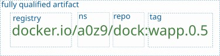

# Docker client basics

Во всех примерах ниже в качестве реестра образов по умолчанию используется
docker hub (```docker.io```). Частный реестр ```dock01.learn.local:8083```, если необходимо, указывается непосредственно в коде.

Подробная документация доступна по ссылке [Docker Cli](https://docs.docker.com/reference/cli/docker/).


## Images & Registries
Для поиска необходимого образа на докерхабе необходимо воспользоваться ресурсами сайта 
[Docker Hub](https://hub.docker.com)
Второй вариант - через докер клиента. Например, поиск образа ```busybox```:

```sh
$ docker search busybox
```
Или для локального реестра docker на сервере dock01.learn.local:8083:

```sh
$ docker search dock01.learn.local:8083/busybox
```

Просмотр всех репозиториев в частном реестре с регистрацией:

```sh
$ curl -k -u admin:pass https://dock01.learn.local:8083/v2/_catalog
```

Получение списка всех тегов для конкретного репозитория ```busybox```,
 есть аналогия с командой ```docker search```:
```
$ curl -k -u admin:pass https://dock01.learn.local:8083/v2/busybox/tags/list
```


Варианты загрузки образа ```library/busybox:latest``` в локальный кэш:

```sh
$ docker pull busybox
$ docker pull busybox:latest
$ docker pull library/busybox:latest
$ docker pull docker.io/library/busybox:latest
```

Полная "координата" образа (или fully qualified artifact) в реестре docker hub складывается из нескольких ключевых лексем:
<p align="left">
  
</p>

Образ ```a0z9/dock:wapp.0.5``` входит в пространство имён ```a0z9``` и находится в репозитории ```dock```. 
Что же касается образа ```busybox``` из реестра Docker Hub, то он относится к Docker Official Images и находится в пространстве имён
 library. Можно также указать конкретный тег или хэш image digest:

```sh
$ docker pull busybox:1.35.1
$ docker pull busybox@sha256:5be7104a4306abe768359a5379e6050ef69a29e9a5f99fcf7f46d5f7e9ba29a2
```

Загрузка образа пользователя a0z9 (namespace) dock:wapp.0.1 

```sh
$ docker pull a0z9/dock:wapp.0.1
```

Загрузка образа ```ubuntu/nginx:latest```:

```sh
$ docker pull ubuntu/nginx
```

Просмотр образов в кэше:

```sh
$ docker images
$ docker image ls
```

Получение метаданных образа:
```sh
$ docker image inspect a0z9/dock:wapp.0.1
$ docker inspect busybox
```

Регистрация в реестре (dockerhub & private):
```sh
$ docker login -u user 
$ docker login dock01.learn.local:8083 -u user
```

Создание дополнительного тэга образа ```bb-quota:latest```  для загрузки в реестр:
```sh
$ docker tag bb-quota:latest dock01.learn.local:8083/busybox:quota.1 
```

Выгрузка образа в частный реестр:
```sh
$ docker push dock01.learn.local:8083/busybox:quota.1 
```

Выгрузка образа в tar архив (```save```) и восстановление 
(```load```), например, после случайного удаления из кэша или на другом хосте:
```sh
$ docker save dock01.learn.local:8083/busybox:quota.1 -o bb-quota.tar
$ docker load -i bb-quota.tar 
```

Образы можно удалять из кэша используя имя или хэш (часть хэша):
```sh
$ docker rmi busybox
$ docker rmi dock01.learn.local:8083/busybox:quota.1
$ docker rmi 6b6b60752f5966 
$ docker rmi 6b
```

Справка по Dockerfile: [Dockerfile help](https://docs.docker.com/reference/dockerfile/). 

Создание образа ```my-image:1.0``` из докерфайла в текущем каталоге:
```sh
$ docker build -t my-image:1.0 .
```

## Container basics
Вывод списка работающих контейнеров в виде таблицы:

```sh
$ docker ps
```
И вывод списка всех контейнеров:
```sh
$ docker ps -a
```
Вывод списка id работающих контейнеров:
```sh
$ docker ps -q
```

Вывод списка полных id (полных sha256 хэшей) работающих контейнеров:
```sh
$ docker ps -q --no-trunc
```

Создание и запуск контейнера с именем bb на базе образа busybox:

```sh
$ docker create --name bb -it busybox
$ docker start bb
```
или одной командой:
```sh
$ docker run --name bb -dit busybox
```
Запуск контейнера содержащего веб приложение:
```sh
$ docker run --name wapp -d -p 8070:8080 a0z9/dock:wapp.0.5
```
где ```8080``` - внутренний tcp порт приложения в контейнере (target port), ```8070``` - tcp порт открытый на хосте. Если мы хотим, чтобы контейнер стартовал автоматически при запуске сервиса docker, необходимо добавить ключ ```--restart=always```:
```sh
$ docker run --name wapp -d -p 8070:8080 --restart always a0z9/dock:wapp.0.5
```
Приложением в контейнере можно управлять передав ему при инициализации переменные среды. Также эти переменные можно прописать и в докер-файле, тогда переменные будут жёстко привязаны к образу. В примере ниже приложению передаётся имя хоста и режим журналирования:
```sh
$ docker run --name wapp -d -p 8070:8080 -e DOCK_HOST=$(uname -n) -e LOG_LEVEL=WARN --restart always a0z9/dock:wapp.0.5
```
И просмотр всех экспортируемых переменных в контейнере:
```sh
$ docker exec wapp env
```
Просмотр всех переменных, включая локальные переменные оболочки:
```sh
docker exec wapp sh -c 'set'
```


Небольшую часть параметров работы контейнера можно изменить не удаляя его и даже не останавливая. Например, для работающего контейнера ```wapp``` можно этим же ключём подключить автостарт:

```sh
$ docker update wapp --restart always
```

Пауза контейнера ```с1``` (освобождаем cpu), восстановление работы, останов и последующий старт:

```sh
$ docker pause c1
$ # bla-bla-bla... smth to do 1
$ docker unpause c1
$ # bla-bla-bla... smth to do 2
$ docker stop c1
$ # bla-bla-bla... smth to do 3
$ docker start c1
```

Запуск команды ls в контейнере ```wapp```:
```sh
docker exec wapp ls -la
```
И для запуска команд в интерактивном режиме:
```sh
docker exec -it container command
```
Часто в разработке контейнер используется для создания контекста и после выполнения одной или нескольких команд не нужен. Реализовать это можно с ключем ```--rm``` который автоматически удаляет контейнер после завершения команды:
```sh
docker run --rm image command
```
Просмотр процессов  в контейнере:
```sh
docker top container
``` 
Сохранение метаданных контейнера ```wapp``` и всех его слоёв включая текущий в образ ```wapp:0.6``` выполняется командой ```commit```:
```sh
docker commit wapp wapp:0.6
``` 
Образ ```wapp:0.6``` создается в кэше и может быть использован для запуска новых контейнеров или для создания образов-потомков. 

Экспорт файловой системы контейнера ```wapp``` в архив и создание нового образа ```wapp:0.7``` из tar архива:

```sh
docker export wapp -o wapp-fs.tar
docker import wapp-fs.tar wapp:0.7
``` 
Или тоже но одной командой:

```sh
docker export wapp | docker import - wapp:0.7
```
Образ ```wapp:0.7``` будет содержать только один слой данных +
дефолтные метаданные, поскольку tar архив содержит только файловую систему.

Удаление остановленного и работающего контейнера ```bbox```:
```sh
$ docker rm bbox
$ docker rm -f bbox
``` 
Внимание! Если при создании контейнера не были использованы тома или подмонтированные каталоги с хоста, то после удаления контейнера все его каталоги и файлы будут удалены. Возможность их дальнейшего восстановления может стремиться к 0 - зависит от загрузки хоста и типа файловой системы.   

## Container quotas

Просмотр ресурсов используемых всеми запущенными контейнерами:
```sh
$ docker stats
```

Сохранение списка ресурсов в виде форматированного json файла:
```sh
$ # one time run:
$ echo {\"stats\":[]} > stats.json
$ # schedule it by cron:
$ cat stats.json | jq ".stats += [ $(docker stats --no-stream --format '{{json .}}' | jq --arg t "$(date '+%d.%m.%Y %H:%M:%S.%6N %Z')" '. + {DateTime: $t}' | sed -z 's/}\n{/},\n{/g') ]" > stats.json
```

Потребление памяти регулируется ключами:
```sh
--memory  
--memory-reservation  
--memory-swap
--kernel-memory
```

Установка верхнего лимита RAM в 30MiB для контейнера ```wapp```: 
```sh
$ docker update wapp -m 30m --memory-swap 30m
```
Докер поддерживает следующие ключи для квотирования cpu:
```sh
--cpu-period  
--cpu-quota  
--cpu-rt-period  
--cpu-rt-runtime  
--cpus  
--cpuset-cpus  
--cpuset-mems  
--cpu-shares
```
Установка верхнего лимита CPU в 0.23 (на одно ядро) для контейнера ```bb-cpu``: 
```sh
$ docker update bb-cpu --cpus 0.23
```
Альтернативный вариант:
```sh
$ docker update bb-cpu  --cpu-period 100000 --cpu-quota 23000
```

Нагрузочный тест (в контейнере должен быть доступен бинарник dd):
```sh
$ docker exec bb-cpu dd if=/dev/zero of=/dev/null&
```
Без процессорной квоты данный код загружает одно ядро на ~100%, но с установленной квотой - на ~23%. 

Часто нужно получить данные по квотам из метаданных контейнера.
Например, форматированный json экспорт базовых квот cpu,mem для контейнера `cpu-load`:

```sh
$ docker inspect cpu-load --format '{"NanoCPUs":"{{.HostConfig.NanoCpus}}", "Memory":"{{.HostConfig.Memory}}"}'
```

## Volumes & catalogs

Создание именованного тома ```project``` и получение списка всех томов:
```sh
$ docker volume create project
$ docker volume ls
```
При инициализации контейнера ключём `-v` можно подмонтировать том:
```sh
$ docker run -d --name wapp -p 8070:8080 -v project:/var/data a0z9/dock:wapp.0.5
```
Каталог `/var/data` будет создан в контейнере, если не существует. Теперь содержимое каталога  `/var/data`  доступно в каталоге хоста: `/var/lib/docker/volumes/project/_data/` и остаётся после удаления контейнера.

Также докер поддерживает 'анонимные' тома - тома с случайными sha256 именами.
Например, для приложения `mysql`, создание анонимного тома можно выполнить в докер-файле
инструкцией `VOLUME /var/lib/mysql` (так обычно и делается) или же при нициализации контейнера (что менее надёжно):
```sh
$ docker run -d --name db -e MARIADB_ROOT_PASSWORD=pass -p 3306:3306  -v /var/lib/mysql mariadb
```
В данном случае, после удаления контейнера `db` все системные и пользовательские бд из каталога `/var/lib/mysql` удалены не будут. Их можно найти в одном из подкаталогов в `/var/lib/docker/volumes/`. Однако, все анонимные и неиспользуемые тома удаляются инструкцией очистки:
```sh
$ docker volume prune -f
```
Ещё более опасное удаление даёт ключ `-a (--all)` - удаляются все именованные тома которые не используются.

Также можно смонтировать каталог хоста или файл в контейнер без использования томов, например:
```sh
docker run --name registry2 -d -p 5002:5000 \
-v /home/student/docker/certs:/certs \
-v /home/student/docker/auth:/auth \
-e REGISTRY_HTTP_TLS_CERTIFICATE=/certs/my.crt \
-e REGISTRY_HTTP_TLS_KEY=/certs/my.key \
-e REGISTRY_AUTH=htpasswd \
-e REGISTRY_AUTH_HTPASSWD_REALM="Registry Realm" \
-e REGISTRY_AUTH_HTPASSWD_PATH=/auth/htpasswd \
--restart=always registry:2
```
В некоторых приложениях полезно монтировать каталог в режиме Read-Only (ro):
```sh
$ docker run -d --name wapp -p 8070:8080 -v /home/student/data:/var/data:ro a0z9/dock:wapp.0.5
```
Так, контейнер `wapp` не сможет изменять и удалять ресурсы в каталоге `/home/student/data` - только читать.


## Networks
Список сетей:
```
$ docker network ls
```
Создание сети `net1`:
```
$ docker network create net1
```
Создание кастомной сети `net2`:
```
$ docker network create net2 --subnet 10.11.12.0/24 --gateway 10.11.12.254
$ docker network inspect net2
```

Отсоединение контейнера `wapp` от дефолтной сети `bridge` 
и подключение к `net1`:
Создание сети `net1`:
```sh
$ docker network disconnect bridge wapp
$ docker network connect net1 wapp
```

Параметры сети и подключенные контейнеры:
```
$ docker network inspect net1 
```
При иициализации контейнера можно сразу указать сеть или сети:
```sh
$ docker  run --name bb -dit --network net1 busybox
```
В пределах каждой не дефолтной сети работает разрешение имён (и по имени и по id сонтейнера и по имени хоста). Например, ping по имени:
```sh
$ docker exec wapp ping bb
$ docker exec bb ping wapp
```
выполнится успешно. Если же явно задать имя хоста при нициализации контейнера:
```sh
$ docker  run --name bb -dit -h box --network net1 busybox  
```
то и следующие 3 команды выполнятся успешно:
```sh
$ docker exec wapp ping bb
$ docker exec wapp ping box
$ docker exec wapp ping 1f9d4fc45c7f
```
где `1f9d4fc45c7f` - укороченный id контейнера `bb`.

## Trainer resources

- https://github.com/a0z9
- https://hub.docker.com/u/a0z9
